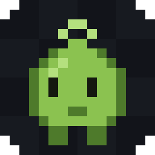

# Myrling

A pixel editor for tiny game creatures, born in Realms of Eldermyr. One HTML file.
Open it and draw.

    open index.html

No build, no server, no install, no internet. Double click the file, or drag it onto a
browser window. Everything runs locally and nothing is uploaded anywhere. Use Chrome or
Edge if you can: they are the browsers that can save your edits straight back into the
files you opened. There is also a small Mac app, below.

MIT licensed. Take it, fork it, ship your own creatures with it.

## Made for one game, useful for yours

The rules baked into this editor — square frames, at most 32 colours, every pixel fully
solid or fully clear, feet on the bottom row — are the art rules of Realms of Eldermyr,
the game it was built for. You do not need that game for any of this to be useful: it is
still a tiny pixel editor that saves straight back over your PNGs. Everything
game-specific sits in plain sight in `index.html` — the checks, the path bar text, the
reference creatures and grounds in the game size view — so making it enforce your own
game's rules is an afternoon of editing one file. Sections below that talk about "the
game" or "the packer" are describing Eldermyr's; read them as the ones you would swap
for your own.

## The Mac app

The same editor in its own window and Dock icon, with in-place saving done natively. It
needs the Xcode command line tools once (`xcode-select --install`), then:

    make app     # builds dist/Myrling.app
    make run     # builds and opens it

The wrapper is one Swift file, `mac/main.swift`, around the very same `index.html` — the
web page is not changed at all. WebKit has no File System Access API, so `mac/bridge.js`
fills in the little of it the editor uses and hands the work to the Swift side: Open PNGs
shows the real open panel, Save over writes the real files, Export lands in your
Downloads folder. The app is built for your machine and ad-hoc signed, which is all a
local tool needs; distributing a signed, notarised download is an Apple Developer
account matter and out of scope here.

The icon is itself a 16 pixel sprite, drawn by `mac/make-icon.py` (`make icon` redraws
it, plus `docs/logo.png` and the page's favicon).

## Why this exists

The game used to store creature art as rows of characters plus a palette, painted one
rectangle at a time while the game ran. It does not any more. It loads real PNG files, so
what you draw here is exactly what ships. That means a plain image editor is the right
tool, and this one has the game's rules built into it.

## Your work is kept

Everything open is written into this browser after every change, and comes back the next
time you open the page. The bottom left corner always says what is being held, how big it
is and when it was last written, and clears the lot in two presses.

Two things it does not keep:

- **Undo history.** A stale undo stack is worse than none, so undo starts fresh each time.
- **Anything after you press Close or Forget all.** Both ask twice before they do it.

If the browser refuses to keep anything, the same corner says so in plain words rather
than losing the work quietly. Keeping it in the browser is not a backup: export the files
when a creature is done.

## Where the files go

This section is the Eldermyr team's workflow. If that is not you, the short version:
Export downloads `name-0.png`, `name-1.png` and so on, Save over writes them back where
they came from, and the path bar is yours to repoint at your own game's art folder.

The bar under the top row says the exact path and the exact command, and follows the name
as you type it:

    Goes to  art-live/creatures/miretoad-0.png, miretoad-1.png     Then run  npm run pack-art

**Folder** is the folder under `art-live`. `creatures` for an enemy. The others the game
uses are `bosses`, `items`, `hero`, `steeds`, `gates` and `stairs`.

**Name** is the creature's key. Lowercase letters, digits, `-` and `_`, starting with a
letter or a digit. Anything else is dropped, and the bar says what the name will actually
be before you export.

Export writes `name-0.png`, `name-1.png` and so on into your downloads folder. Move them
into `art-live/<folder>/` and run `npm run pack-art` from the game's repo.

## Saving over the files you opened

In Chrome, Edge and the Mac app, a file opened through **Open PNGs** or dropped onto the
window comes with permission to write it back. The **Save over** button sits next to
Export: press it (or `Cmd + S` / `Ctrl + S`) and your edits are written straight into the
originals, wherever they live — open them from your game's art folder and there is no
moving files about at all.

The button is greyed out until the sprite in front of you actually came from files this
session — hover it and it says exactly what to do to turn it on. In Firefox and Safari it
never appears, because those browsers do not let a page write files.

Plain words about how it behaves:

- The browser asks **once per file** the first time, with its own "save changes" prompt.
  If it only lets some through on the first press, the top bar says so: press Save over
  again for the rest.
- It obeys the same checks as Export. A sprite the packer would refuse arms the button to
  **Save anyway?** for a second press, the same way Close asks twice.
- A frame added since opening has no file yet, so that one goes to downloads and the top
  bar tells you to put it next to the others.
- Renaming the sprite makes the names stop matching the files, so the button greys out
  and Export takes over. Same if the sprite was only brought back from browser storage:
  the browser cannot keep file permissions across visits, so open the files again to get
  the button back.

## Opening art

- **Open PNGs** or drop files anywhere on the window. Several at once is fine.
- Files named `bat-0.png` and `bat-1.png` open as **one sprite with two frames**. That is
  the same naming the game's packer reads.
- A file that will not open no longer loses the rest of the drop. The ones that worked open
  and the top bar names the ones that did not.
- Frames have to start at 0 with no gaps, so a set numbered 2 and 4 opens renumbered to 0
  and 1, and the top bar says so.
- Anything else opens as its own sprite. To pull a loose file in as another frame of the
  sprite you are working on, use **Add from file** in the frames row.
- **New sprite** starts a blank square at the size in the box next to it. 16 is the usual
  size for a creature.

Open sprites are listed down the left. Click one to work on it. A red dot beside one means
the packer would refuse it as it is.

## The rules the game holds you to

The checks panel on the right is live, and it splits the same way the packer does. All
of the refusals answer to one checkbox above the panel: **Hold me to the game's rules**,
on out of the box. Untick it and the editor stops refusing soft pixels, extra colours
and non-square pictures — what you paint, part see-through pixels included, is exactly
what exports. For Eldermyr art leave it on, because the packer itself still refuses
those files.

**Red is refused.** The packer writes nothing and exits with an error:

- **A part see-through pixel.** Every pixel is fully solid or fully clear. With the rules
  on this editor never makes one, but a file you open can carry them, and then a bar
  appears at the top with a button to snap them. Anything at half strength or more becomes
  solid, the rest becomes clear.
- **Not square.** A picture that is not square gets squashed.
- **More than 32 colours.** A count that high means the picture was resized or blurred
  rather than drawn cell by cell.
- **An empty frame**, or **frames that are not all the same size**.
- **A name or folder that cannot be a filename.**

Export refuses these too, and says which one. If you want the file anyway, an **Export
anyway** button appears next to it.

**Amber is worth a look.** The packer lets these through but they are almost always wrong:

- **Nothing on the bottom row.** The game plants the bottom row of the picture at the
  creature's feet. If nothing is painted there the creature hovers on every screen in the
  game. Empty rows belong at the top. The guide line at the bottom of the canvas turns red.
- **One frame only.** The game wants two, a standing one and a stepping one.
- **No clear pixels at all**, which means the background got painted in.
- **A later frame using colours frame 0 does not have.** All the frames of one creature
  share one palette.

The blue line down the middle is where the game centres the creature.

## Drawing

| Tool | Key | What it does |
| --- | --- | --- |
| Pencil | D | Draw with the current colour. Drag for a freehand line. |
| Eraser | E | Clear back to nothing. Right click does this with any tool. |
| Fill | F | Flood the touching pixels of the same colour. |
| Line | L | Drag a straight line. It only makes the lines pixel art wants: flat, upright, or a true one-for-one diagonal, whichever the drag is closest to. |
| Pick | S | Take the colour under the pointer, then go back to the pencil. |
| Select | V | Drag a box, then drag inside it to move those pixels. |

With a box in place, painting stays inside it. Arrow keys nudge the box. With no box, arrow
keys move the whole picture. Delete clears what is in the box. Esc drops the box.

`Cmd + C` (or `Ctrl + C`) copies the pixels in the box, `Cmd + X` cuts them, and `Cmd + V`
pastes — into the same sprite or a different one, since the clipboard travels between
open sprites. A paste lands centred as a floating box: drag it into place and it sets
down when the box is dropped. Pasting into a smaller sprite trims to fit and says so.

**Flip** mirrors the frame left to right. Creatures are always drawn facing right and the
game flips them itself when they walk the other way, so this is for fixing one you drew
facing the wrong way.

Every tool key, and the onion skin and grid toggles, can be rebound: click the key in the
**Keys** panel at the bottom right, press the new one, and it is kept in your browser. If
the new key already did another job, the two swap, so nothing is ever unreachable. One
button puts them all back.

The side columns are draggable at their inner edges if the sprite list or the panels need
more room; double clicking a divider puts it back.

Undo is `Cmd + Z` or `Ctrl + Z`, redo is `Shift + Z`. It goes back 200 steps, or fewer on a
very large sprite so the undo stack cannot eat all the memory.

The palette fills up from the colours already in the open sprite, most used first. The
colour square and the hex box next to it set what you draw with.

**Opacity**, under the colour, sets how hard the paint lands: at 50%, red over white
leaves pink. With the game's rules on, a painted pixel always comes out fully solid —
over empty ground the colour lands at full strength, because the game refuses part
see-through pixels. With the rules off it is true alpha blending, and the softness is
kept. Either way a stroke blends each pixel once, so a slow drag does not darken its
own line.

Zoom with the wheel over the canvas, with `-` and `+`, or with Fit.

## Frames and the walk cycle

The frames row is under the canvas. Add, copy and delete are there. **Onion skin** shows
the frame before the current one faintly underneath, so a leg can be moved a known
distance. **Play** runs the frames in the game size view at the speed on the slider, which
is the only honest way to tell whether a walk cycle works.

## Game size

Top right, and it is the panel that matters. A sprite at 16 pixels tells you nothing on its
own, so this draws it the size a player actually sees, on the game's own ground, with the
game's own shadow under it, next to three creatures already in the game: a grave rat, the
hero, and a wild ogre.

- **Window** picks how big the player's window is. 3 screen pixels to a drawn pixel is the
  normal case; 2 is a small window and 4 is a large one.
- The faint squares are map tiles. A 16 pixel creature is about two thirds of a tile.
- **Ground** switches between the realm's grass, dirt path, stone, sand, snow, burnt ground
  and dungeon floor, in the colours the game paints them.

Drawing on a bigger grid does not make a creature bigger in the game, only finer. A new
creature is drawn to fill its box, and the box is the same either way.

## Notes

- Tested in Chrome. Any current browser should work.
- The picture you export is the picture you drew, pixel for pixel. Opening a shipped sprite
  and exporting it untouched gives back an identical image. The file's bytes can differ,
  because the PNG is written again here, but not one pixel moves.
- No outline. The game used to grow a dark edge around every creature and it does not any
  more, so the silhouette you draw is the silhouette that ships. Dark pixels are for
  interior work: a seam, a joint, the line between two body parts.
- The game does add a ground shadow under every creature. Do not paint one in. The game
  size view draws the real one, so what you see there is what a player sees.
